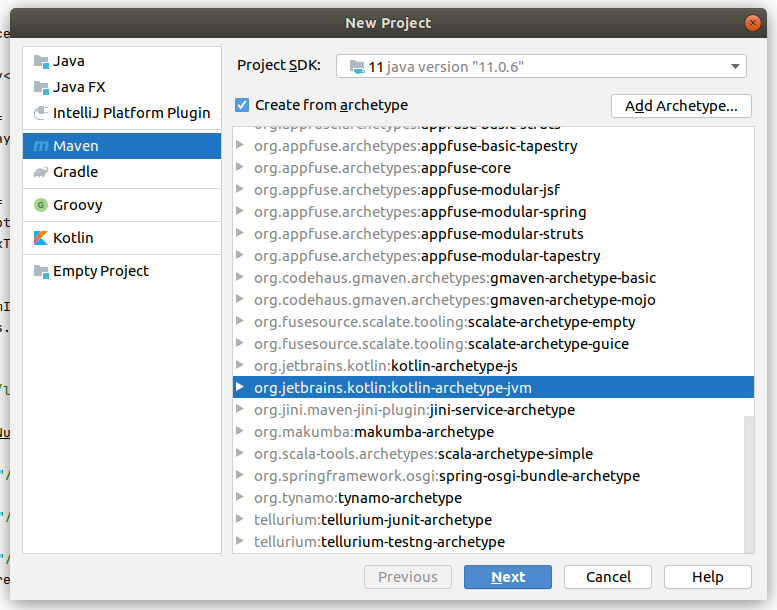
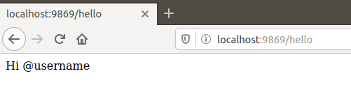
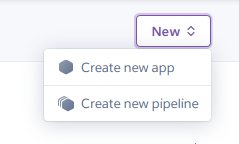

<h1>Статья: быстный старт kotlin+spark+Heroku</h1>

<i>Изначально хотел разместить статью на Habr-е, но в итоге отказался от этогот, т. к. статейка оказалась небольшой, это скорее даже интенсивная пятиминутка.</i>

Обычно, я разрабатываю приложения для смартфонов, но недавно потребовалось написать простой REST API и разместить его на публичном хостинге Heroku. В данном материале я подробно расскажу и покажу как сделать собственное, очень простое, серверное приложение за 15 минут и разместить его.

<h2>1 - Создание простого Spark приложения</h2>

Сначала создаём Maven проект в  IntellijIdea CE, используя шаблон kotlin-archetype-jvm


Далее указываем имя проекта и место его расположения (я назвал проект Hellohabrahabr).

Переходим в pom.xml, чтобы внести необходимые изменения.
Во первых, чтобы проект собирался в независимый JAR файл (со всеми зависимостями), добавляем необходимый плагин, в блок \<plugins\>:
```xml
<plugin>
    <groupId>org.apache.maven.plugins</groupId>
    <artifactId>maven-assembly-plugin</artifactId>
    <version>3.2.0</version>
    <executions>
        <execution>
            <id>make-assembly</id>
            <phase>package</phase>
            <goals> <goal>single</goal> </goals>
            <configuration>
                <archive>
                    <manifest>
                        <mainClass>ru.gc986.HelloKt</mainClass>
                    </manifest>
                </archive>
                <descriptorRefs>
                    <descriptorRef>jar-with-dependencies</descriptorRef>
                </descriptorRefs>
            </configuration>
        </execution>
    </executions>
</plugin>
```

Теперь добавляем зависимости, для работы с фреймворком Spark в блок <dependencies>:

```xml
<dependency>
    <groupId>com.sparkjava</groupId>
    <artifactId>spark-core</artifactId>
    <version>2.5.4</version>
</dependency>
```

Всё готово чтобы сделать свой сервер.
В главном пакете, по умолчанию, создан класс Hello.kt. Для начала нам нужно указать порт на котором будет работать наше приложение. Будем считать что он указывается с помощью аргументов командной строки, при запуске приложения. Если порт не указан то установится значение по умолчанию 9869.
Теперь напишем обработчик для get запроса «hello». В качестве ответа будем возвращать пользователю строку "Hi @username". В итоге должно получиться следующее:

```kotlin
import spark.Spark
fun main(args: Array<String>) {
    val port = if (args.isNotEmpty())
                    args[0].toInt()
                else
                    9869
    println("http://localhost:$port") // печатаем в консоль адрес сервера
    Spark.port(port)
    Spark.get("hello"){ _, _ ->
        "Hi @username"
    }
}
```

Запускайте функцию main и проверяйте результат. Если всё сделали правильно, то после открытия страницы «http://localhost:9869/hello», вы должны увидеть приветствие:


<h2>2 — Размещаем на хостинге Heroku</h2>
Теперь наше приложение нужно разместить в сети, чтобы любой желающий мог до него достучаться. В этом нам поможет облачная платформа Heroku.com. Данная платформа предоставляет хостинг, как платный так и бесплатный. Для наших экспериментов вполне хватит бесплатного (система позволит создать не более 5 проектов).
Регистрируемся и переходим на панель проектов. Создаём новый проект:


Указываем уникальное имя и жмём «Create app».
Далее нам нужно указать параметры для сборки. Система настроена таким образом, что если она понимает что в корне репозитория появились изменения, она пересобирает проект. Воспользуемся «Heroku git», для хранения проекта.


Теперь нам нужно установить набор утилит «Heroku CLI» на компьютере - https://devcenter.heroku.com/articles/heroku-cli. Соответствующие пакеты есть для всех распространённых операционных систем.

Далее нужно залогиниться в «Heroku CLI» на вашем компьютере, перейти в папку проекта, инициализировать git репозиторий, связать его с вашим проектом на Heroku и слить изменения на сервер:

```terminal
heroku login
cd my-project/
git init
heroku git:remote -a hello-habrahabr
git add .
git commit -am "make it better"
git push heroku master
```

Если вы всё сделано правильно, то проект окажется на хостинге и сразу собирётся. Но не запуститься :) Так как в проект нужно ещё передать идентификатор порта, на котором должно заработать приложение. После каждой сборки и запуска, порт, который выделяет Heroku, может меняться. По этой причине мы и указали в коде сервера, что порт назначается через параметры.

<h2>3 - Procfile</h2>
Для настройки запускаемого приложения, на сервере, используется файл настроек «Procfile». В нашем случае он будет иметь следующее содержание:

web: java -jar target/Hellohabrahabr-1.0-SNAPSHOT-jar-with-dependencies.jar $PORT

Обратите внимание что сервер запускает наше приложение как обычный jar файл, а номер порта передаёт с помощью параметра $PORT.

Если вы не любите консольный git клиент, то пользуйтесь любимым, с графическим интерфейсом.

Теперь переходим по адресу https://hello-habrahabr.herokuapp.com/hello (или https://имя_вашего_проекта.herokuapp.com/hello) и смотрим на результат.

Всё, это была база. Далее вы можете подключить к проекту любые библиотеки и реализовать бизнес логику.


<b>Репозиторий с проектом Kotlin-Spark - https://github.com/gc986/Hellohabrahabr</b>